# Web UI Documentation

  

Mindloop now includes a comprehensive Web UI to manage your productivity workflow. This interface provides access to all core features including Tasks, Journaling, Notes, Habit Tracking, Focus Timer, Intent Management, and Daily Summaries.

## Table of Contents
- [Home Dashboard](#home-dashboard)
- [Tasks](#tasks)
- [Write (Journal & Notes)](#write-journal--notes)
- [Habit Tracker](#habit-tracker)
- [Focus Timer](#focus-timer)
- [Daily Intent](#daily-intent)
- [The Void](#the-void)
- [Summary](#summary)
- [Settings](#settings)
- [Gamification & Celebrations](#gamification--celebrations)
- [Dark Mode & Theming](#dark-mode--theming)
- [Filtering, Searching & Sorting](#filtering-searching--sorting)
- [Technical Architecture](#technical-architecture)

## Home Dashboard
The home page acts as an Interactive Command Center. It provides an at-a-glance view of your current status, including today's intent and active side quests. Directly from the dashboard, you can:
- Check off pending tasks
- Log daily habits
- Capture quick notes
- Jump into The Void

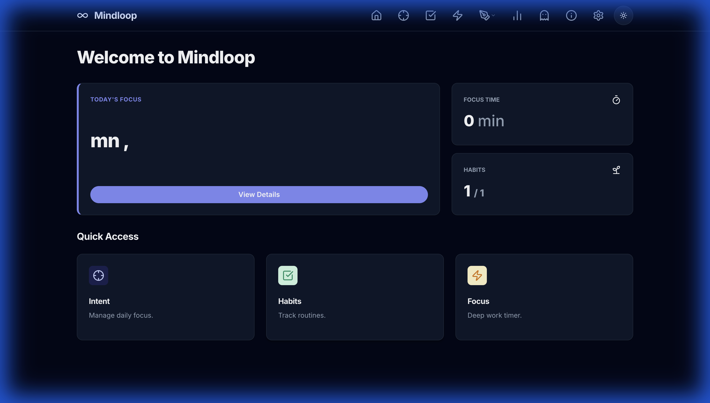

## Tasks
Manage your daily to-dos and break them down into sub-tasks. You can link tasks to your intents and focus sessions for better tracking.

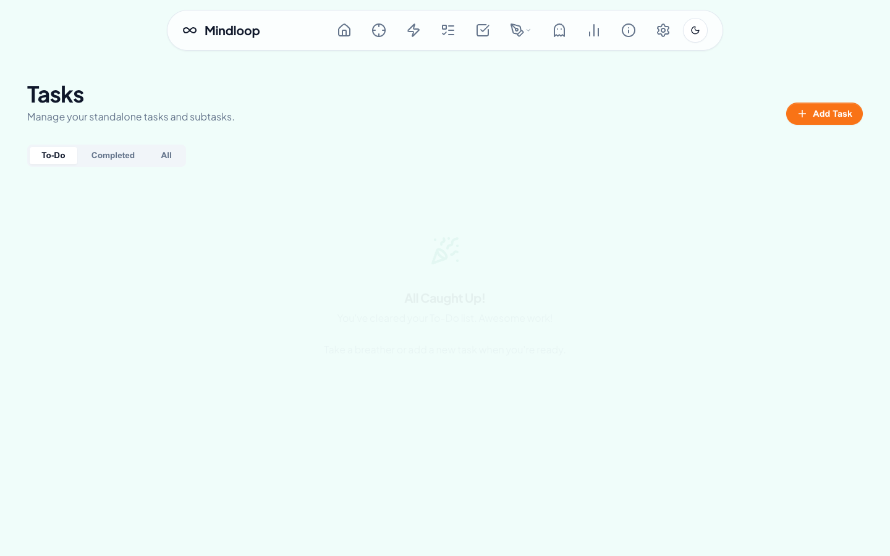

## Write (Journal & Notes)
A dedicated space for your thoughts.
- **Journal**: Capture your reflections, ideas, and mood. Supports a clean, distraction-free writing environment.
- **AI-assisted entries**: Auto-generate a journal draft from daily, weekly, or yearly summary data before saving it.
- **Notes**: Jot down quick thoughts or keep longer-form reference material.

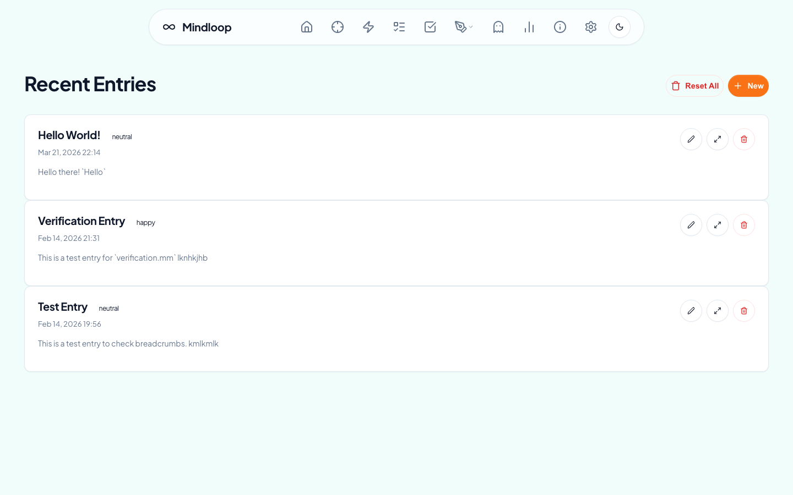
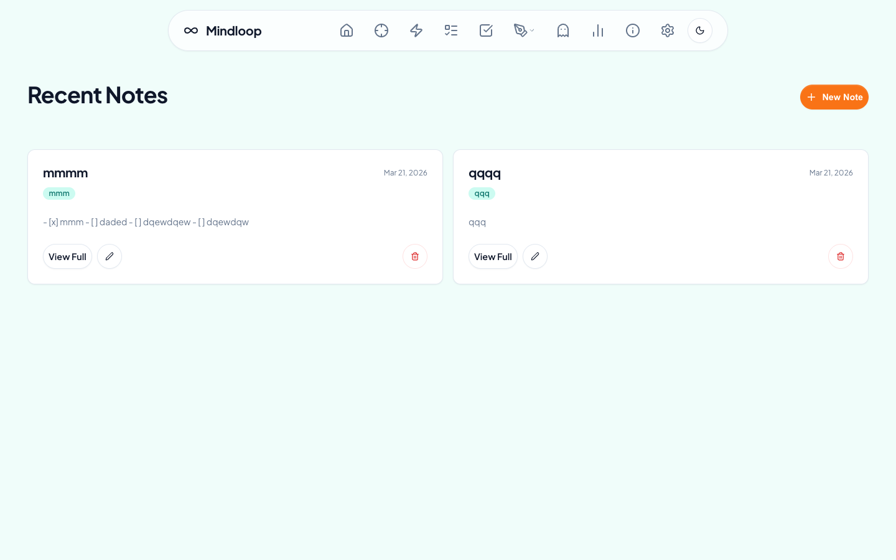

## Habit Tracker
Track your daily habits and monitor your progress over time. The Habits interface makes it easy to log your activities and stay consistent with a visual heatmap.

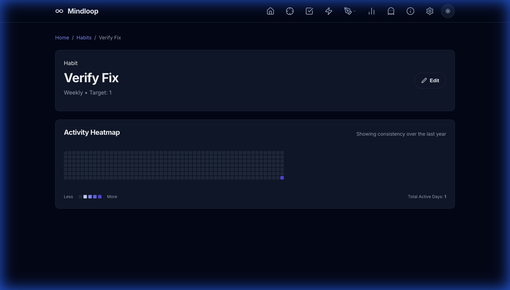

## Focus Timer
The Focus Timer helps you stay productive by using time-blocking techniques. You can start, stop, and manage your focus sessions directly from the browser.

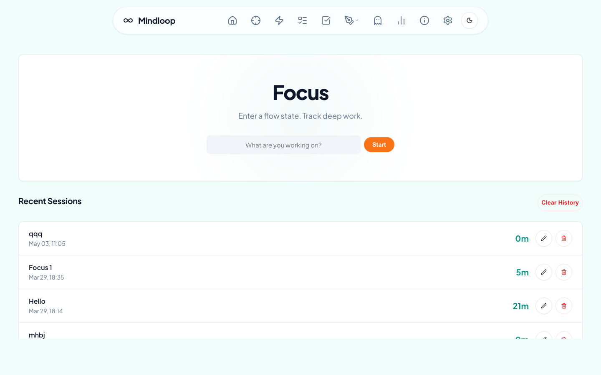

## Daily Intent
Set and track your main intention for the day. This feature helps you stay aligned with your most important goals. Includes Side Quests for managing interruptions.

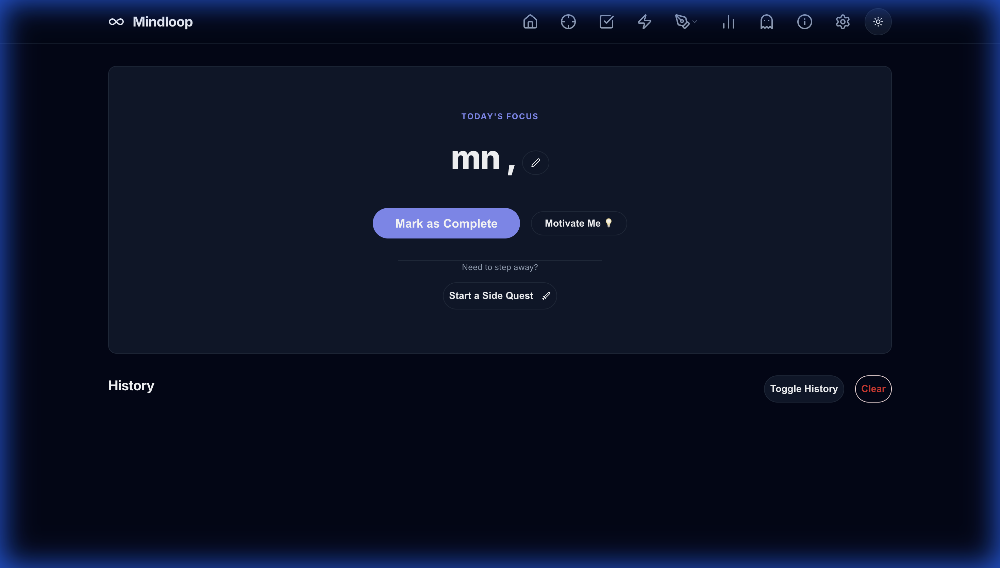

## The Void
A special place to vent or release thoughts you don't want to keep.

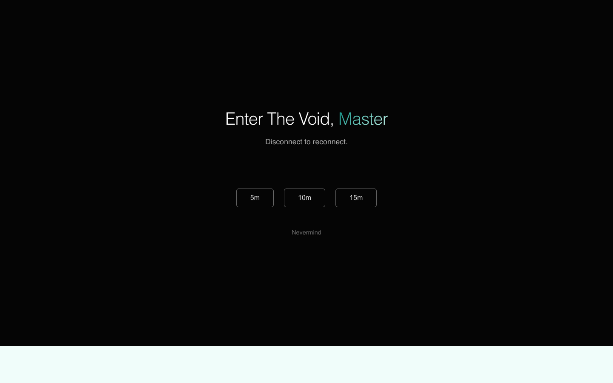

## Summary
View a summary of your activities, including completed focus sessions, habits logged, and journal entries.

The Summary page also includes an AI Overview shortcut that opens the journal generation flow with the selected summary period.

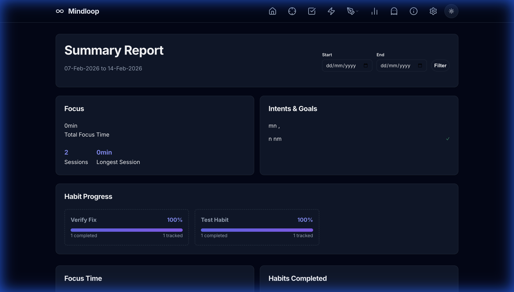

## Settings
Customize your Mindloop experience. You can set your name, choose AI models, manage API keys, and tweak system prompts used by AI-assisted journal generation.

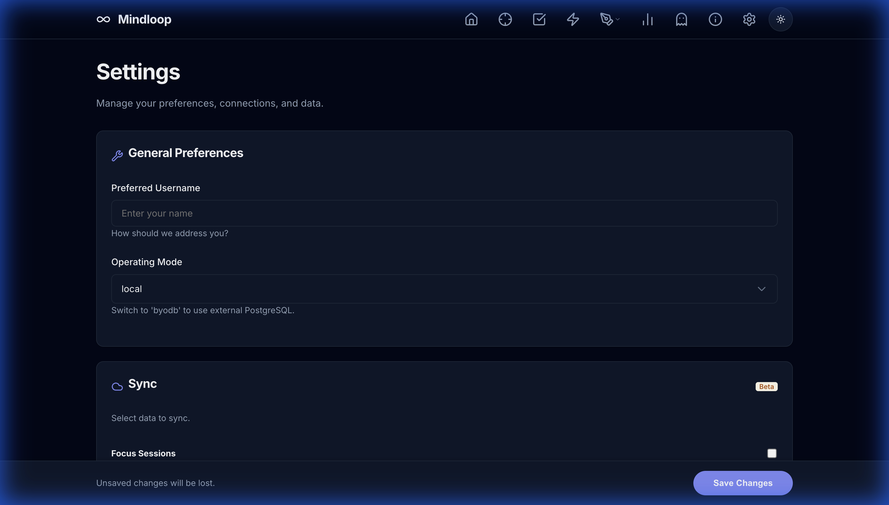

## Gamification & Celebrations
Mindloop rewards your productivity with points and celebrations.
- **Points System**: Earn points for every activity completed.
- **Customization**: Set your own point rewards and milestone interval in the Settings page.
- **Confetti**: Celebrate small wins with instant confetti animations.
- **Milestones**: Reach configurable point increments, 200 points by default, to unlock a special full-screen milestone celebration.

## Dark Mode & Theming
Mindloop features a classy "Teal and Orange" default theme. It includes a built-in Dark Mode for comfortable viewing in low-light environments. Toggle it using the moon/sun icon in the navigation bar.

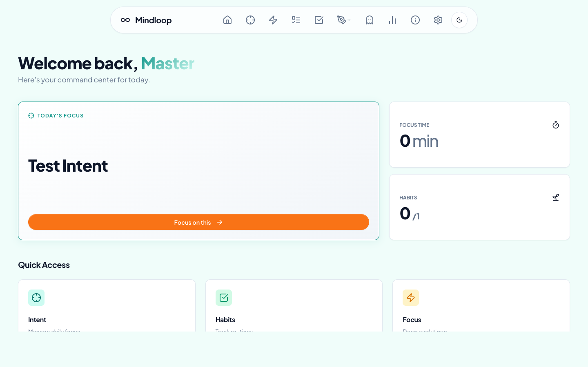

## Filtering, Searching & Sorting
Every major listing view in Mindloop (Tasks, Habits, Notes, Journal, Focus Sessions, and Intents) features an integrated, real-time command bar at the top of the list:
- **Instant Search**: Type in the search box to immediately highlight items containing your query.
- **Dynamic Filtering**: Filter lists contextually (e.g., Habits by *Interval*, Tasks by *To-Do/Completed*, Focus Sessions by *Duration*).
- **Sorting**: Keep lists organized with specialized sorts (e.g., Newest First, Longest Duration, Highest Streak).
- **Drag & Drop**: Use the *Custom (Drag & Drop)* sort option in the Tasks view to manually reorder tasks.

## Command Palette (Cmd+K)
Mindloop features a global spotlight-style Command Palette. Hit `Cmd+K` anywhere in the Web UI to instantly open a search bar to jump to specific pages, tasks, habits, intents, or features without taking your hands off the keyboard.

## Technical Architecture
For details on the underlying UI architecture, HTMX integration, and styling system, please refer to [ARCHITECTURE_UI.md](ARCHITECTURE_UI.md).
