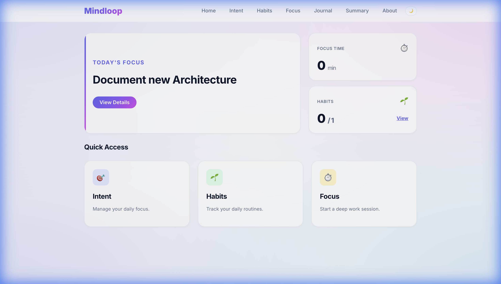
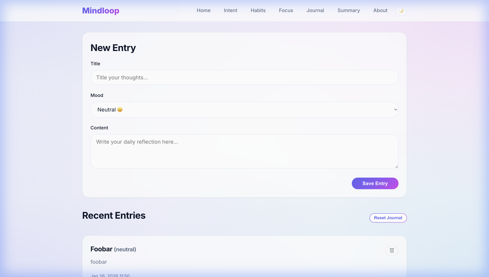
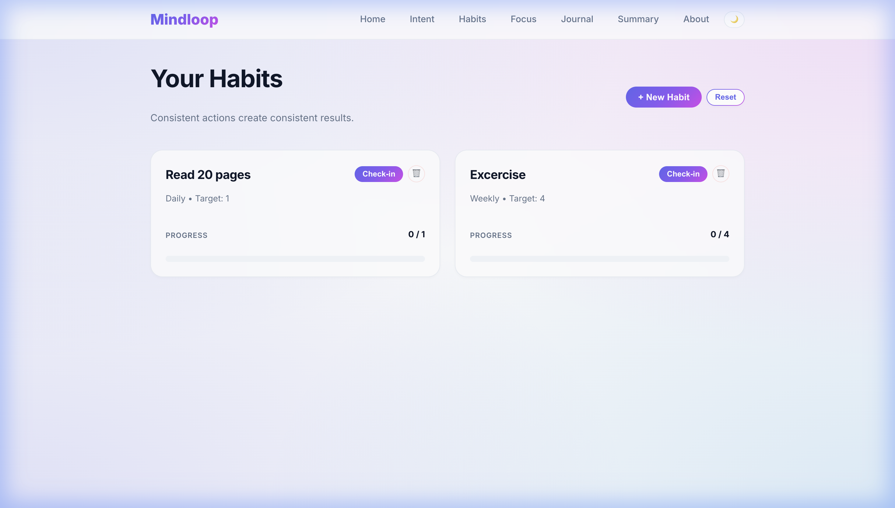
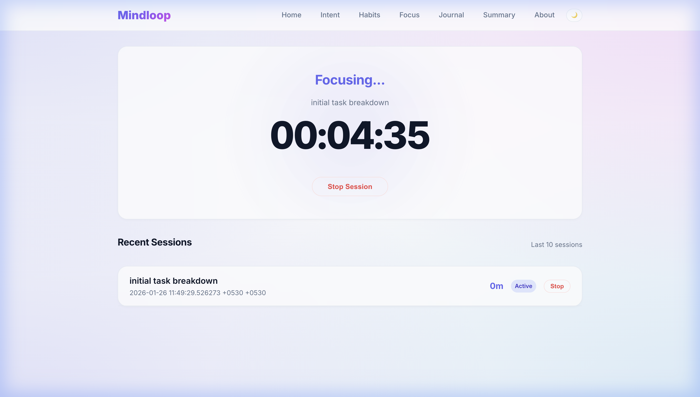
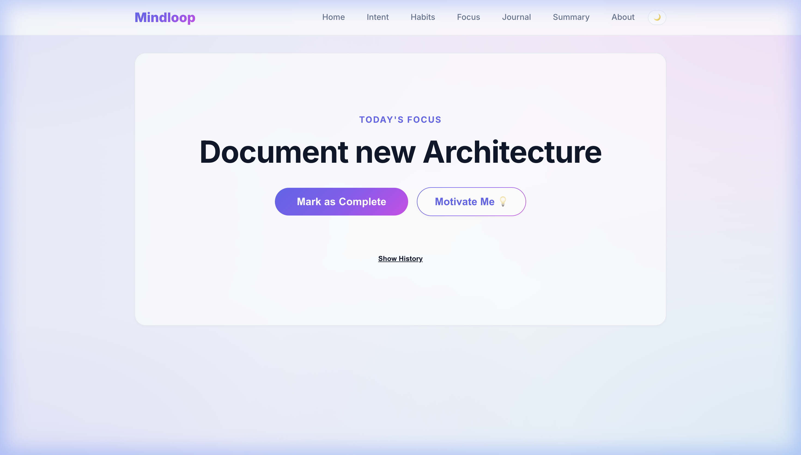
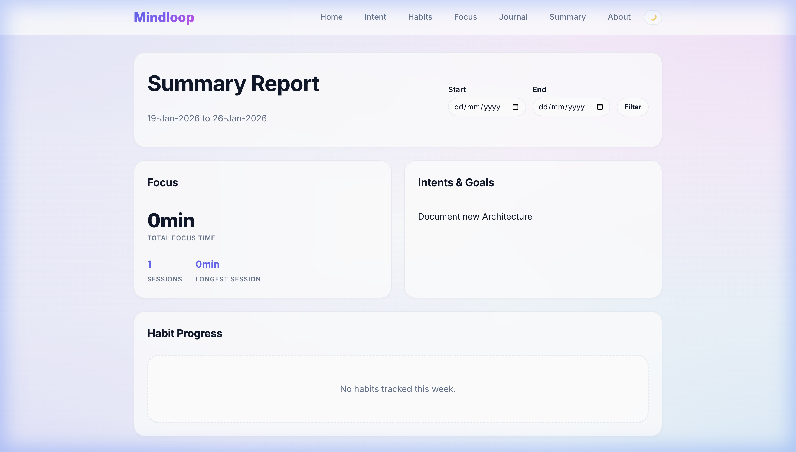
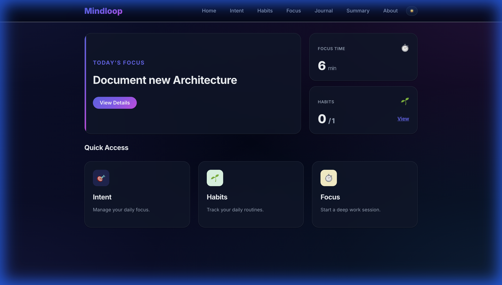

# Web UI Documentation

Mindloop now includes a comprehensive Web UI to manage your productivity workflow. This interface provides access to all core features including Journaling, Habit Tracking, Focus Timer, Intent Management, and Daily Summaries.

## Home Dashboard
The home page provides an at-a-glance view of your current status, including today's intent and quick access to other features.

## Journal
The Journal feature allows you to capture your thoughts, ideas, and reflections. It supports a clean, distraction-free writing environment.

## Habit Tracker
Track your daily habits and monitor your progress over time. The Habits interface makes it easy to log your activities and stay consistent.

## Focus Timer
The Focus Timer helps you stay productive by using time-blocking techniques. You can start, stop, and manage your focus sessions directly from the browser.

## Daily Intent
Set and track your main intention for the day. This feature helps you stay aligned with your most important goals.

## Summary
View a summary of your activities, including completed focus sessions, habits logged, and journal entries.

## Dark Mode
Mindloop includes a built-in Dark Mode for comfortable viewing in low-light environments. Toggle it using the moon/sun icon in the navigation bar.

## Technical Architecture
For details on the underlying UI architecture, HTMX integration, and styling system, please refer to [ARCHITECTURE_UI.md](ARCHITECTURE_UI.md).
